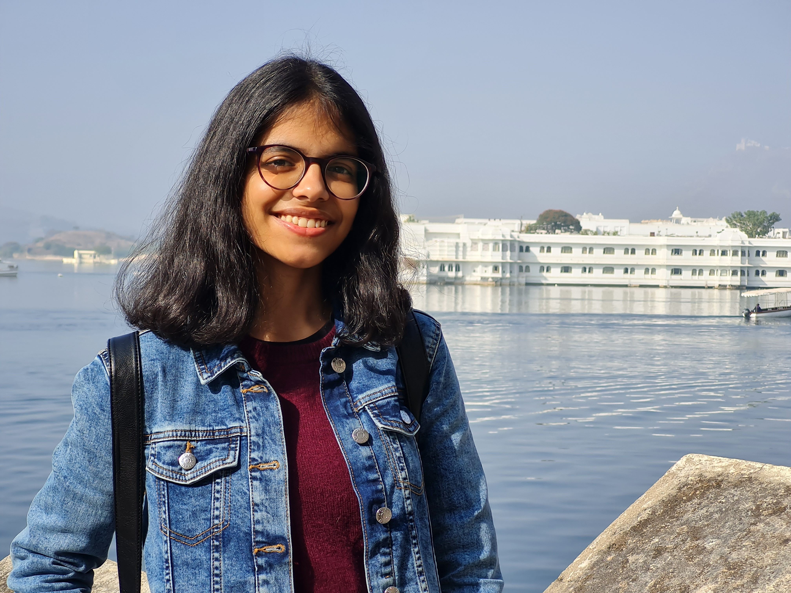
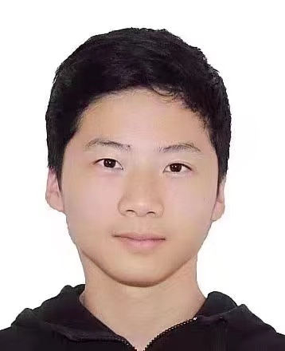
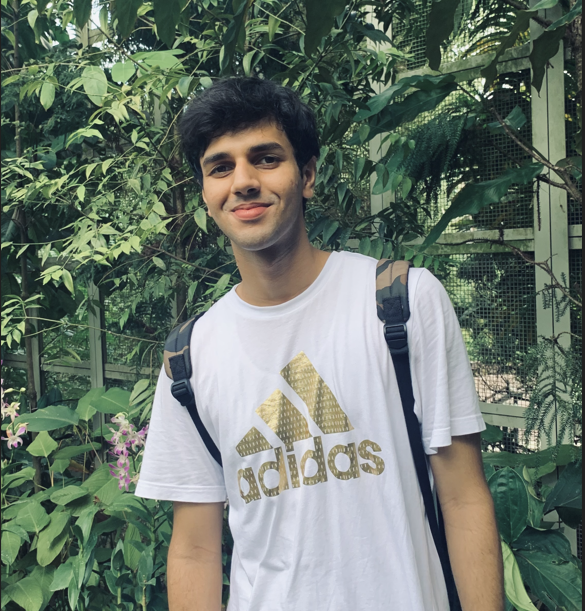

# About Us

We are a team based in the [School of Computing, National University of Singapore](http://www.comp.nus.edu.sg).

You can reach us at the email `seer[at]comp.nus.edu.sg`

## Project team

### Charvi Priyadarshi 

[[github](https://github.com/PriyadarshiCharvi)]
[[portfolio](team/priyadarshicharvi.md)]

* Role: Developer
* Responsibilities: Implementation of functionalities and UI

### Hu Tongyan

[[github](http://github.com/hutongyan)]
[[portfolio](team/hutongyan.md)]

* Role: Developer
* Responsibilities: Deliverables + Testing

### Arnav Bajpai

[[github](http://github.com/arnavbajpai)] [[portfolio](team/arnavbajpai.md)]

* Role: Developer
* Responsibilities: CLI Commands + Error Handling

### Jean Doe

[[github](http://github.com/johndoe)]
[[portfolio](team/johndoe.md)]

* Role: Developer
* Responsibilities: Dev Ops + Threading

### James Doe

[[github](http://github.com/johndoe)]
[[portfolio](team/johndoe.md)]

* Role: Developer
* Responsibilities: UI
