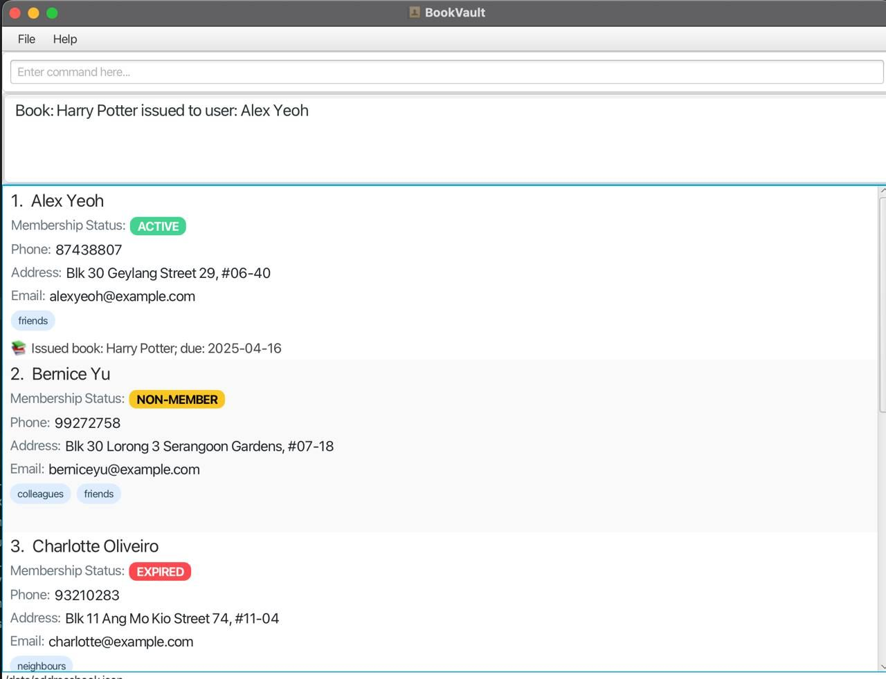
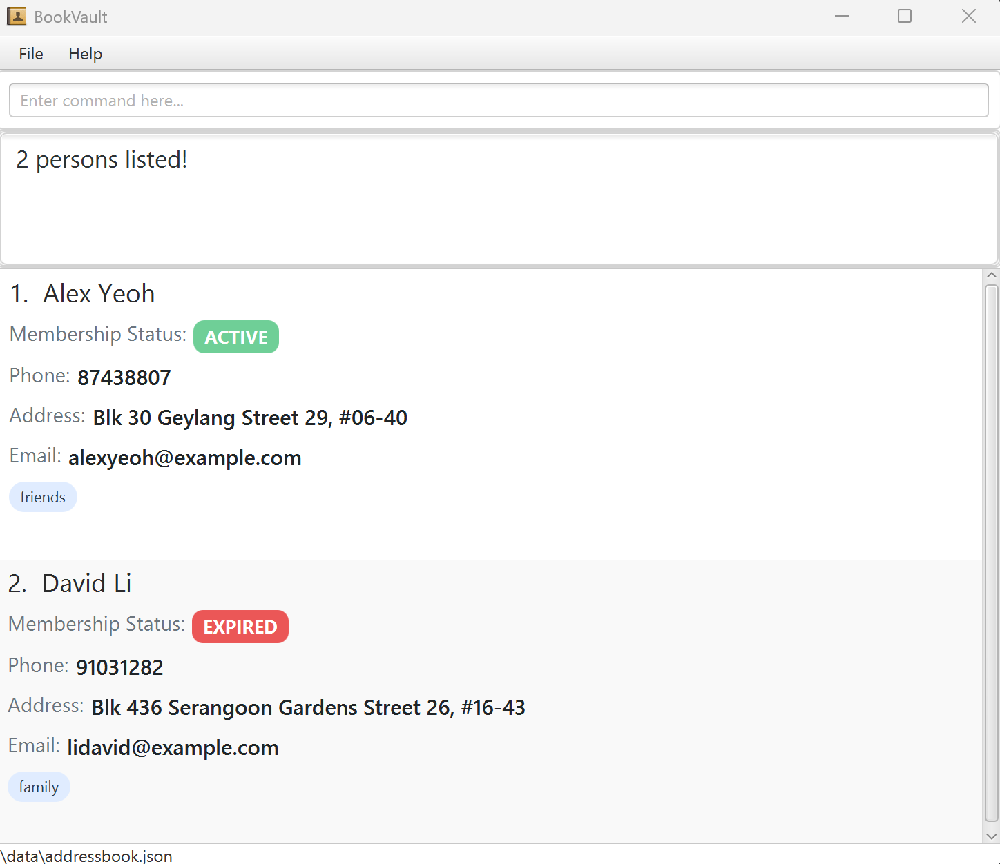

# BookVault User Guide

BookVault is a **desktop app for managing library users and books**, optimized for use via a Command Line Interface (CLI), while retaining the advantages of a Graphical User Interface (GUI). It allows librarians to **quickly manage user memberships** and **maintain an up-to-date book catalog**.

<!-- * Table of Contents -->
<page-nav-print />

--------------------------------------------------------------------------------------------------------------------

## Quick start

1. Ensure you have Java `17` or above installed in your Computer. 
   **Mac users:** Ensure you have the precise JDK version prescribed [here](https://se-education.org/guides/tutorials/javaInstallationMac.html).

1. Download the latest `.jar` file from [here](https://github.com/AY2425S2-CS2103T-W13-3/tp/releases).

1. Copy the file to the folder you want to use as the _home folder_ (main folder)for your BookVault.

1. Open a command terminal, `cd` into the folder you put the jar file in, and use the `java -jar bookvault.jar` command to run the application. 
   A GUI similar to the below should appear in a few seconds. Note how the app contains some sample data. 
   

1. Type the command in the command box and press Enter to execute it. e.g. typing **`help`** and pressing Enter will open the help window. 
   Some example commands you can try:

    * `list_users` : Lists all contacts.

    * `add n/John Doe p/98765432 e/johnd@example.com a/John street, block 123, #01-01 m/ACTIVE` : Adds a user named `John Doe` with the newly added Membership status label.

    * `delete 3` : Deletes the 3rd contact shown in the current list.
    * `clear` : Deletes all contacts.
    * `add_book b/Wizard of Oz` : Adds a book 'Wizard of Oz'.
    * `delete_book b/Wizard of Oz` : Deletes the book 'Wizard of Oz'
    * `exit` : Exits the app.

1. Refer to the [Features](#features) below for details of each command.

--------------------------------------------------------------------------------------------------------------------

## Features

<box type="info" seamless>

**Notes about the command format:** 

* Words in `UPPER_CASE` are the parameters to be supplied by the user. 
  e.g. in `add n/NAME`, `NAME` is a parameter which can be used as `add n/John Doe`.

* Items in square brackets are optional. 
  e.g `n/NAME [t/TAG]` can be used as `n/John Doe t/friend` or as `n/John Doe`.

* Items with `…`​ after them can be used multiple times including zero times. 
  e.g. `[t/TAG]…​` can be used as ` ` (i.e. 0 times), `t/friend`, `t/friend t/family` etc.

* Parameters can be in any order. 
  e.g. if the command specifies `n/NAME p/PHONE_NUMBER`, `p/PHONE_NUMBER n/NAME` is also acceptable.

* Extraneous parameters for commands that do not take in parameters (such as `help`, `exit` and `clear`) will be ignored. 
  e.g. if the command specifies `help 123`, it will be interpreted as `help`.

* If you are using a PDF version of this document, be careful when copying and pasting commands that span multiple lines as space characters surrounding line-breaks may be omitted when copied over to the application.
  </box>

**IMPORTANT NOTE:** A person is identified by their _EMAIL ID_. So, while 2 users can have the same name, they need to have a unique Email Id.

### Viewing help : `help`

Shows a message explaning how to access the help page.

Format: `help`

### Adding a person: `add`

Adds a person to the user list.

Format: `add n/NAME p/PHONE_NUMBER e/EMAIL a/ADDRESS m/MEMBERSHIP_STATUS [t/TAG]…​`

<box type="tip" seamless>

**Tip:** A person can have any number of tags (including 0).
</box>

**Note:** A person needs to have a unique email id to avoid duplicates!

**Membership Status** can only be **_ACTIVE, EXPIRED_** or **_NON-MEMBER_**

**Phone numbers** should not include extensions.

Examples:
* `add n/John Doe p/98765432 e/johnd@example.com a/John street, block 123, #01-01 m/ACTIVE`
* `add n/Betsy Crowe t/friend e/betsycrowe@example.com a/Newgate Prison p/1234567 m/NON-MEMBER t/criminal `

### Listing users : `list_users`

Shows a list of all persons in the library address book. Supports additional filters as well, to display specific users.

Format: `list_users [e/EMAIL] [n/NAME] [m/MEMBERSHIP_STATUS] [t/TAG]`

Examples:

`list_users`

`list_users n/John Doe`

`list_users b/The Hobbit`

### Editing a person : `edit`

Edits an existing person in the user list.

Format: `edit INDEX [n/NAME] [p/PHONE] [e/EMAIL] [a/ADDRESS] [m/MEMBERSHIP] [t/TAG]…​`

* Edits the person at the specified `INDEX`. The index refers to the index number shown in the displayed person list. The index **must be a positive integer** 1, 2, 3, …​
* At least one of the optional fields must be provided.
* Existing values will be updated to the input values.
* When editing tags, the existing tags of the person will be removed i.e adding of tags is not cumulative.
* You can remove all the person’s tags by typing `t/` without
  specifying any tags after it.

Examples:
*  `edit 1 p/91234567 e/johndoe@example.com` Edits the phone number and email address of the 1st person to be `91234567` and `johndoe@example.com` respectively.
*  `edit 2 n/Betsy Crower t/` Edits the name of the 2nd person to be `Betsy Crower` and clears all existing tags.

### Locating persons by name: `find`

Finds persons whose **names** contain any of the given keywords.

Format: `find KEYWORD [MORE_KEYWORDS]`

* The search is case-insensitive. e.g `hans` will match `Hans`
* The order of the keywords does not matter. e.g. `Hans Bo` will match `Bo Hans`
* Only the name is searched.
* Only full words will be matched e.g. `Han` will not match `Hans`
* Persons matching at least one keyword will be returned (i.e. `OR` search).
  e.g. `Hans Bo` will return `Hans Gruber`, `Bo Yang`

Examples:
* `find John` returns `john` and `John Doe`
* `find alex david` returns `Alex Yeoh`, `David Li` 
  

### Deleting a person : `delete`

Deletes the specified person from the user list.

Format: `delete INDEX`

* Deletes the person at the specified `INDEX`.
* The index refers to the index number shown in the displayed person list.
* The index **must be a positive integer** 1, 2, 3, …​
* Deleting a person also automatically returns all books they have currently borrowed.

Examples:
* `list` followed by `delete 2` deletes the 2nd person in the user list.
* `find Betsy` followed by `delete 1` deletes the 1st person in the results of the `find` command.

### Adding a book : `add_book`

Adds a book to the catalog.

Format: `add_book b/BOOK_NAME [t/TAG]…​`

* `book name` is case-sensitive and unique throughout the library.
* `book name` should only contain alphanumeric characters or spaces, and it should not be blank.

Example:
* `add_book b/Harry Potter t/JKR`

### Deleting a book : `delete_book`

Deletes a book from the catalog.

* Only books **not** currently issued to a user can be deleted from the library.

Format: `delete_book b/BOOK_NAME`

Example:
* `delete_book b/Harry Potter`

### Listing all books : `list_books`

Lists all books in the catalog

* All existing books including borrowed books are listed.

Format: `list_books`

### Issuing a book : `issue`

Issues a book to a user. The issue duration is 2 weeks from starting from current date time.

**Format:**  
`issue b/BOOK_NAME e/EMAIL`

* Issues the specified book (`BOOK_NAME`) to the user with the given email (`EMAIL`).
* The book must exist in the system.
* The user must be a registered person in the system.
* If the book is unavailable, the command will fail.

**Examples:**
* `issue b/Percy Jackson e/alexyeoh@example.com`
    * Issues the book *Percy Jackson* to *alexyeoh@example.com*.
* `issue b/Harry Potter e/johndoe@example.com`
    * Issues the book *Harry Potter* to *johndoe@example.com*.

### Returning a book : `return`

Marks a borrowed book as returned and calculates overdue fines.

_Overdue fines for books is calculated as follows:_ 
  For members, S$1 per day after return date. 
  For non-members, S\$2 per day after return date.

**Format:**  
`return b/BOOK_NAME on d/<return_date>`

* Marks the specified book (`BOOK_NAME`) as returned.
* The system will calculate any overdue fines.
* If the book is already available, an error message will be shown.
* If the book does not exist, an error message will be shown.

**Examples:**
* `return b/Percy Jackson on d/20/04/2025`
    * Marks *Percy Jackson* as returned and calculates any overdue fines.
* `return b/Harry Potter on d/20/04/2025`
    * Marks *Harry Potter* as returned and calculates any overdue fines.

### Listing borrowed books : `list_borrowed_books`

Lists all books borrowed by a specified user.

**Format:**  
`list_borrowed_books e/EMAIL`

* Lists all books borrowed by the user with the given email (`EMAIL`).
* If the user does not exist, an error message will be shown.
* If the user is not currently borrowing any books, a message will indicate that.

**Examples:**
* `list_borrowed_books e/alexyeoh@example.com`
    * Lists all books borrowed by *alexyeoh@example.com*.
* `list_borrowed_books e/johndoe@example.com`
    * Lists all books borrowed by *johndoe@example.com*.

### Displaying overdue books : `display_overdue`

Displays a list of overdue books and the users who have borrowed them.

**Format:**  
`display_overdue`

* Lists all books that are overdue and the users who have borrowed them.
* If no books are overdue, a message will indicate that there are no overdue books.
- _Note: A book is classified as overdue only if it has been issued for a minimum of 14 days. This approach aligns with standard practices in real-world library systems and maintains consistency with our issuing logic. As such, testing this feature may be limited, as issue dates cannot be manually adjusted._

**Examples:**
* `display_overdue`
    * Displays a list of overdue books and the users who have borrowed them.

### Extending the borrowing duration : `extend`

Extends the duration for which a user can borrow a book without paying overdue fees. Postpones the return date by 2 weeks.

**Format:**  
`extend b/BOOK_NAME e/EMAIL`

* Extends the borrowing duration for the specified book (`BOOK_NAME`) for the user with the given email (`EMAIL`).
* The book must exist in the system and must be borrowed by the specified user.
* If the user or the book is not found, or if the book is not currently borrowed, the command will fail.

**Examples:**
* `extend b/Percy Jackson e/alexyeoh@example.com`
    * Extends the borrowing duration for *Percy Jackson* for *alexyeoh@example.com*.
* `extend b/Harry Potter e/johndoe@example.com`
    * Extends the borrowing duration for *Harry Potter* for *johndoe@example.com*.

### Clearing all entries : `clear`

Clears all entries from the user list.

Format: `clear`

### Exiting the program : `exit`

Exits the program.

Format: `exit`

### Saving the data

BookVault data are saved in the hard disk automatically after any command that changes the data. There is no need to save manually.

### Editing the data file

BookVault data are saved automatically as a JSON file `[JAR file location]/data/bookvault.json`. Advanced users are welcome to update data directly by editing that data file.

<box type="warning" seamless>

**Caution:**
If your changes to the data file makes its format invalid, BookVault will discard all data and start with an empty data file at the next run.  Hence, it is recommended to take a backup of the file before editing it. 
Furthermore, certain edits can cause the BookVault to behave in unexpected ways (e.g., if a value entered is outside the acceptable range). Therefore, edit the data file only if you are confident that you can update it correctly.
</box>

### Archiving data files `[coming in v2.0]`

_Details coming soon ..._

--------------------------------------------------------------------------------------------------------------------

## FAQ

**Q**: How do I transfer my data to another Computer? 
**A**: Install the app in the other computer and overwrite the empty data file it creates with the file that contains the data of your previous BookVault home folder.

--------------------------------------------------------------------------------------------------------------------

## Known issues

1. **When using multiple screens**, if you move the application to a secondary screen, and later switch to using only the primary screen, the GUI will open off-screen. The remedy is to delete the `preferences.json` file created by the application before running the application again.
2. **If you minimize the Help Window** and then run the `help` command (or use the `Help` menu, or the keyboard shortcut `F1`) again, the original Help Window will remain minimized, and no new Help Window will appear. The remedy is to manually restore the minimized Help Window.

--------------------------------------------------------------------------------------------------------------------

## Command summary

Action                  | Format, Examples
------------------------|----------------------------------------------------------------------------------------------------------------------------------------------------------------------
**Add**                 | `add n/NAME p/PHONE_NUMBER e/EMAIL a/ADDRESS m/MEMBERSHIP_STATUS [t/TAG]…​`   e.g., `add n/James Ho p/22224444 e/jamesho@example.com a/123, Clementi Rd, 1234665 m/EXPIRED t/friend t/colleague`
**Clear**               | `clear`
**Delete**              | `delete INDEX`  e.g., `delete 3`
**Edit**                | `edit INDEX [n/NAME] [p/PHONE_NUMBER] [e/EMAIL] [a/ADDRESS] [t/TAG]…​`  e.g.,`edit 2 n/James Lee e/jameslee@example.com`
**Find**                | `find KEYWORD [MORE_KEYWORDS]`  e.g., `find James Jake`
**List**                | `list_users [n/NAME] [e/EMAIL] [m/MEMBERSHIP_STATUS] [a/ADDRESS]`   e.g., `list_users m/ACTIVE`
**Add Book**            | `add_book b/NAME_OF_BOOK`   e.g., `add_book b/Wizard of Oz`
**Delete Book**         | `delete_book b/NAME_OF_BOOK`   e.g., `delete_book b/Wizard of Oz`
**List Books**          | `list_books`
**Help**                | `help`
**Issue**               | `issue b/BOOK_NAME e/EMAIL`   e.g., `issue b/Percy Jackson e/alexyeoh@example.com`
**Return**              | `return b/BOOK_NAME on d/DATE`   e.g., `return b/Percy Jackson`
**List Borrowed Books** | `list_borrowed_books e/EMAIL`   e.g., `list_borrowed_books e/alexyeoh@example.com`
**Display Overdue**     | `display_overdue`   e.g., `display_overdue`
**Extend**              | `extend b/BOOK_NAME e/EMAIL`   e.g., `extend b/Percy Jackson e/alexyeoh@example.com`

